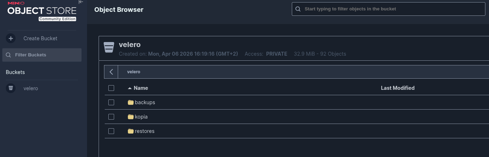
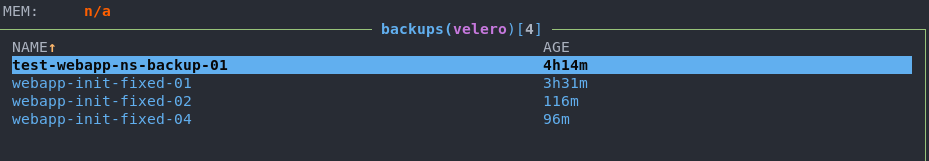
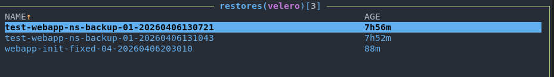
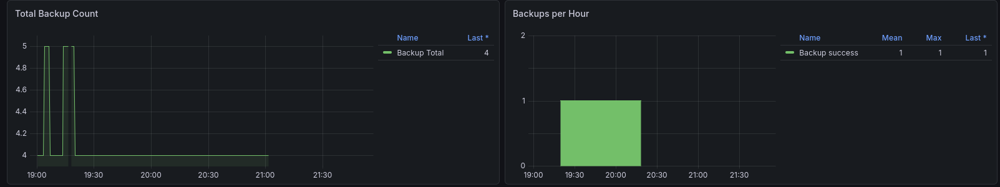
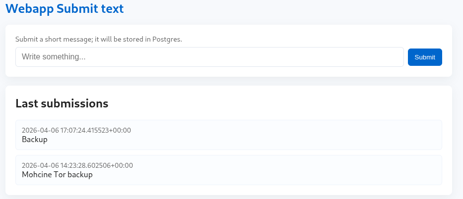

# Kubernetes Backup Lab Velero, Kopia, MinIO & Monitoring 🚀


Small lab demonstrating backup and restore for a Kubernetes application using Velero (with Kopia) and MinIO as S3-compatible storage. Includes an example web application (Postgres-backed), NFS-backed PVCs (nfs-csi), and a monitoring stack (Prometheus + Grafana).

## 📖 Table of Contents
- [🔍 Key Concepts](#concepts-cles)
- [🚀 Deployment](#deployment)
- [📦 Results / Verification](#resultats--verification)
- [🧹 Cleanup](#cleanup)
- [⚙️ Configuration & Details](#configuration--details)
- [🧪 Tests (backup/restore)](#tests-backuprestore)
- [📚 References](#references)

---

<a id="concepts-cles"></a>
## 🔍 Key Concepts

### 1. Velero
Velero orchestrates backups and restores for Kubernetes resources and persistent volumes. In this lab Velero uses an S3-compatible backend (MinIO) and optionally the Kopia plugin for efficient deduplicated backups.

Key points:
- Schedules, Restores, and Backup lifecycle management
- Emits metrics with prefix `velero_` (scraped by Prometheus)

### 2. Kopia
Kopia is used as the backup engine (plugin or repository) offering deduplication and encryption for backup data.

Key points:
- Repository encryption via password
- Efficient storage and transfer for large data sets

### 3. MinIO (S3-compatible)
Object storage for backup objects. MinIO hosts the `velero` bucket used by Velero/Kopia.

Key points:
- API (9000) and Console (9001)
- Example bucket: `velero`

### 4. CSI snapshots & StorageClass
CSI snapshot support allows consistent PV snapshots. This lab uses an NFS server backed by `nfs-csi` StorageClass to provision PersistentVolumes.
### 5. Monitoring

Prometheus should scrape Velero (metrics prefixed with velero_), as well as kube-state-metrics and node-exporter. Expose scrape endpoints via ServiceMonitor/PodMonitor (kube-prometheus-stack) or with Prometheus annotations (e.g. prometheus.io/scrape: "true") so they are discovered automatically.

Grafana provides ready-to-use dashboards import the "Velero Overview" dashboard (ID 23838) from https://grafana.com/grafana/dashboards/23838-velero-overview/ or provision it via Grafana dashboard provisioning for automatic deployment.

---

### Architecture

This lab demonstrates a robust Kubernetes backup and restore workflow using Velero with the Kopia uploader. Persistent data from a PostgreSQL database and a web application, stored on an NFS server, is backed up as snapshots. These snapshots and cluster metadata are then transferred to MinIO, which serves as the S3-compatible object storage destination. The deployment is fully managed via Helm and monitored using the kube-prometheus-stack (Prometheus and Grafana) for real-time visibility into backup success and system health.


<a id="deployment"></a>
## 🚀 Deployment

### Prérequis

- Kubernetes (v1.33+)
- kubectl
- Helm
- An ingress controller (NGINX recommended)
- Metallb for MinIO access and grafana (e.g. `minio-api.local` and `minio-console.local`, `grafana.local` in `/etc/hosts`)

### Scripts

This repo contains convenience scripts under `Helm/`:

- `Helm/Minio/helm_deploy.sh` --> deploy MinIO
- `Helm/Webapp/run-webapp-manifests.sh` --> deploy the sample webapp and Postgres
- `Helm/Velero/helm_deploy.sh` --> deploy Velero (configure S3/Kopia)
- `Helm/Monitoring/deploy-monitoring.sh` --> deploy kube-prometheus-stack
- `Helm/Nfs/run-apply.sh` --> deploy nfs server

### Quick start

Run these in order (examples):

```bash
# 0) NFS server (for PVCs)
cd Helm/Nfs
./run-apply.sh

# 1) MinIO
cd Helm/Minio
./helm_deploy.sh

# 2) Velero
cd Helm/Velero
./helm_deploy.sh

# 3) Webapp + Postgres
cd Helm/Webapp
./run-webapp-manifests.sh

# 4) Monitoring
cd Helm/Monitoring
./deploy-monitoring.sh
```
---

<a id="resultats--verification"></a>
## 📦 Results / Verification

After deploying, verify the main components:

```bash
# Pods
kubectl get pods -A | egrep "nfs|minio|velero|prometheus|grafana|postgres"

# Check Velero backups
velero backup get -n velero
```

Example screenshot placeholders after running the lab:

### MinIO Console

*MinIO Console view buckets, backups, restore operations and the Kopia repository.*

### Velero Backups

*List of Velero backups showing names, creation times and status.*

### Velero Restores

*Past Velero restores with status and completion details.*

### Monitoring Dashboard

*Grafana dashboard displaying Velero metrics (backup durations, success/failure counts) and overall cluster health.*

### Example Webapp

*Sample web application UI showing data stored in PostgreSQL (protected by Velero/Kopia backups).* 

---

<a id="cleanup"></a>
## 🧹 Cleanup

To remove deployed resources, run the cleanup scripts or delete resources via kubectl/helm.

Example (quick cleanup):

```bash
# Remove monitoring
helm uninstall kube-prom-stack -n monitoring || true
kubectl delete ns monitoring --wait || true

# Remove velero
helm uninstall velero -n velero || true
kubectl delete ns velero --wait || true

# Remove webapp
kubectl delete -f Helm/Webapp --ignore-not-found
kubectl delete ns webapp-ns --wait || true

# Remove minio
helm uninstall minio -n default || true
```

--

### Namespaces
- `webapp-ns` -> sample app + Postgres
- `velero` -> Velero + Kopia and secrets
- `monitoring` -> Prometheus + Grafana
- `nfs-ns` -> NFS server
- `minio` -> MinIO server + console

### Storage
- StorageClass: `nfs-csi` (used for Postgres/MiniO PVCs and Grafana persistence in the lab)

### MinIO details

| Item | Value |
|---|---|
| API endpoint | `minio-api.local:9000` |
| Console | `minio-console.local:9001` |
| Bucket | `velero` |
| Repo secret | `velero-repo-credentials` (see `Helm/Velero/velero-repo-secret.yaml`) |

### Secrets

`Helm/Velero/velero-repo-secret.yaml` contains S3 credentials and Kopia repository password used by Velero. Replace the example values with secure secrets in production.

---

<a id="configuration--details"></a>
## ⚙️ Configuration & Details

### Velero

- Namespace: `velero`
- Helm chart: `velero/velero`
- Configuration: `Helm/Velero/values.yaml`

### MinIO

- Namespace: `minio`
- Helm chart: `minio/minio`
- Configuration: `Helm/Minio/values.yaml`

### Monitoring

- Namespace: `monitoring`
- Helm chart: `prometheus-community/kube-prometheus-stack`
- Configuration: `Helm/Monitoring/values.yaml`

---

<a id="tests-backuprestore"></a>
## 🧪 Tests (backup/restore)

Create a manual backup and verify:

```bash
velero backup create smoke-test-$(date +%s) --include-namespaces webapp-ns
velero backup describe smoke-test-$(date +%s) -n velero
velero backup logs smoke-test-$(date +%s) -n velero
```

Restore into the cluster (dry-run or into new namespace):

```bash
velero restore create --from-backup smoke-test-$(date +%s)
velero restore get -n velero
kubectl get pods -n webapp-ns
```

Verify PostgreSQL data by connecting to the database and checking records.

---

<a id="references"></a>
## 📚 RReferences

- Velero: https://velero.io/
- Kopia: https://www.kopia.io/
- MinIO: https://min.io/
- kube-prometheus-stack: https://github.com/prometheus-community/helm-charts/tree/main/charts/kube-prometheus-stack

---

I hope this lab provides a useful starting point for exploring Kubernetes backup and restore with Velero, Kopia, and MinIO, along with monitoring best practices.

